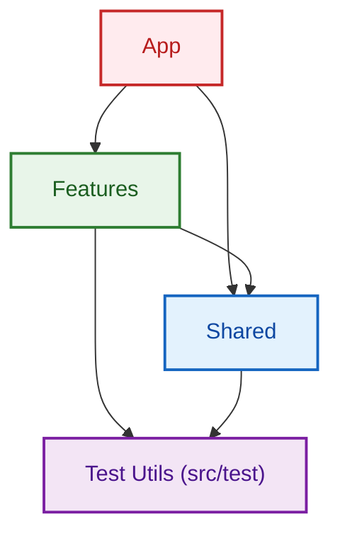

# Feature-Based Folder Structure (Tauri + React)

This repo follows a feature-first layout that keeps UI and backend concerns separate,
prevents cross-feature coupling, and scales from small tools to larger products.

## Goals
- Organize UI and logic by feature, not by file type.
- Keep React and Rust concerns cleanly separated.
- Enforce one-way dependencies to prevent cross-feature coupling.
- Scale without turning shared folders into a dumping ground.

## High-Level Structure
```
.
├── docs/               # Architecture notes, ADRs, dev docs
├── public/             # Static assets (icons, preload files)
├── src/                # React (frontend)
│   ├── app/            # App composition (screens, routing)
│   ├── features/       # Feature modules (vertical slices)
│   ├── components/     # Shared UI primitives
│   ├── hooks/          # Shared hooks (non-feature-specific)
│   ├── lib/            # Shared frontend infrastructure
│   ├── test/           # Test utilities and global mocks (test-utils)
│   ├── assets/         # Images, fonts, static UI assets
│   └── types/          # Shared TS types (optional)
└── src-tauri/          # Tauri / Rust backend
    ├── src/
    │   ├── commands/   # Tauri commands (API surface)
    │   ├── features/   # Feature-specific Rust logic
    │   ├── services/   # Shared Rust services (fs, db, ipc)
    │   └── main.rs
    ├── capabilities/  # Tauri permissions
    ├── icons/
    └── gen/
```

## Frontend Architecture

### Layer 1 — Shared (Global)
Folders:
- `src/components/`
- `src/hooks/`
- `src/lib/`

Purpose:
- Reusable, domain-agnostic code.
- UI primitives, design system wrappers, infrastructure helpers.

Rules:
- Do not import from `src/features/` or `src/app/`.
- May import from other shared folders.
- Avoid business logic.

Examples:
- `src/components/ui/button.tsx`
- `src/lib/tauri.ts` (thin IPC wrapper)
- `src/hooks/useDebounce.ts`

### Layer 1.5 — Test Utilities
Folder: `src/test/`

Purpose:
- Global mocks (e.g., Tauri API mocks).
- Test setup files and custom renderers.
- Shared test helpers.

Rules:
- Accessible by **Shared**, **Features**, and **App** layers (typically in `.test.ts` files).
- Can import from `shared`, `features`, and `app` (for integration testing).

### Layer 2 — Features
Each feature owns its UI and logic end-to-end.

```
src/features/file-explorer/
├── components/     # Feature-specific UI
├── hooks/          # Feature-specific hooks
├── tauri/          # IPC calls for this feature
├── state.ts        # Local state / reducers
├── permissions.ts  # Feature-level rules
└── index.ts        # Public exports
```

Rules:
- May import from shared (`components`, `hooks`, `lib`) and itself.
- Must not import from other features.
- Cross-feature interaction is data-only (IDs, payloads).

Example:
```ts
// src/features/file-explorer/tauri/readDirectory.ts
invoke("read_directory", { path });
```

### Layer 3 — App (Composition)
Purpose:
- Compose screens, windows, menus.
- Glue features together without domain logic.

Rules:
- May import from any feature and shared layer.
- Must not contain business logic.

Example:
```
src/app/
├── layout.tsx
├── main-window.tsx
├── settings-window.tsx
└── shortcuts.ts
```

## Backend Architecture (Rust / Tauri)

### Shared Layer
Pure infrastructure, no feature knowledge.

```
src-tauri/src/services/
├── filesystem.rs
├── database.rs
└── permissions.rs
```

### Feature Layer
Feature-owned business logic that talks to shared services.

```
src-tauri/src/features/file_explorer/
├── commands.rs
├── service.rs
└── model.rs
```

### Commands (Boundary)
Thin API surface that delegates to feature logic.

```
src-tauri/src/commands/
├── file_explorer.rs
├── settings.rs
└── mod.rs
```

Rules:
- Commands do validation and mapping only.
- Commands must not contain business logic.

## IPC Rule (Critical)
- React features call Tauri commands.
- Commands call Rust features.
- No frontend feature calls Rust services directly.
- No shared mutable state across features.

## Dependency Direction (Frontend)
Enforced by `eslint-plugin-boundaries`:



## Example Mappings
- `src/components/file-explorer` → `src/features/file-explorer/components`
- `src/components/kibo-ui` → `src/components/kibo-ui` (shared UI)
- `src/lib` → `src/lib` (shared IPC, helpers, infra)

## Architectural Smells
- A feature importing another feature (React or Rust).
- Frontend calling Rust services directly (bypassing commands).
- Global `permissions.ts` that knows about all features.
- `src/components` containing business UI.
- Rust commands doing real logic.
